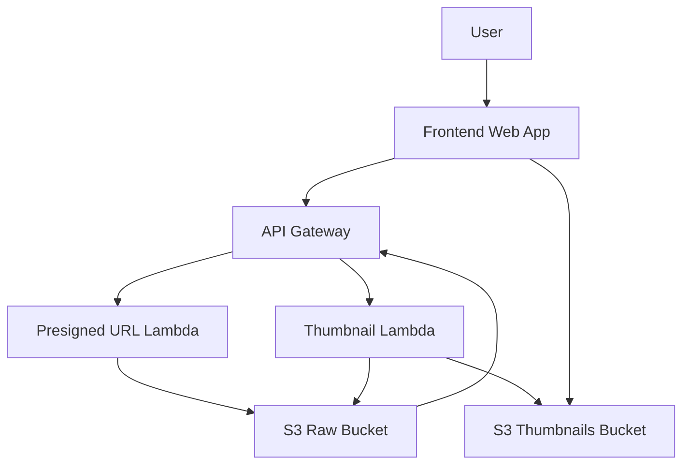

# Photo Sharing Application

[](https://aws.amazon.com)
[](https://serverless.com)

A serverless photo sharing application that:
1. Generates secure upload URLs
2. Automatically creates thumbnails
3. Displays images in a responsive gallery

## System Architecture



## Workflow

### Upload Sequence


## Components

### 1. Frontend Application
- Single-page HTML/CSS/JavaScript app
- Features:
  - Drag-and-drop upload
  - Progress tracking
  - Thumbnail gallery
- Hosted on S3 Static Website

### 2. Backend Services
| Service | Description | Endpoint |
|---------|-------------|----------|
| Presigned URL Generator | Creates secure upload URLs | `POST /generate-url` |
| Thumbnail Processor | Resizes uploaded images | Auto-triggered |

### 3. Storage Buckets
| Bucket | Purpose | Event Configuration |
|--------|---------|---------------------|
| photo-uploads-raw | Original images | Trigger on PutObject |
| photo-uploads-thumb | Processed thumbnails | - |

## Deployment

### Prerequisites
- AWS Account
- AWS CLI configured
- Node.js 16+

### Installation
```bash
# Clone repository
git clone https://github.com/guderian120/s3_photo_sharing
cd s3_photo_sharing

```

## Error Handling


## Monitoring
- CloudWatch Alarms for:
  - Failed uploads
  - Thumbnail generation errors
  - API Gateway 5xx errors

## License
Apache 2.0 - See [LICENSE](LICENSE) for details
```
