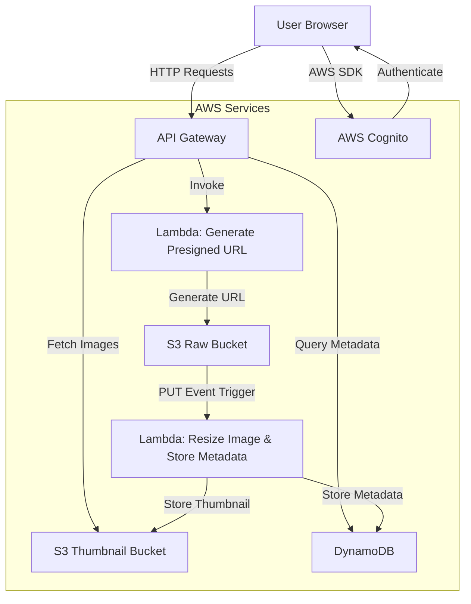
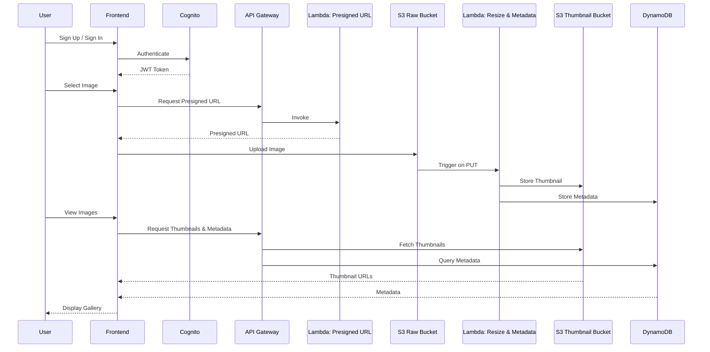

# Photo Cloud Application Documentation

## Overview
Photo Cloud is a serverless web-based photo-sharing application that enables users to securely upload, store, and view images. It leverages AWS services for authentication, storage, processing, and metadata management, ensuring scalability, security, and performance. Users can sign up, sign in, upload images, and view their own or all images, with thumbnails generated automatically and metadata stored in DynamoDB for efficient retrieval and management.

## Architecture

### Components
The application is built using a serverless architecture on AWS, with the following components:

- **Frontend**: A single-page HTML/JavaScript application using Axios for API calls and AWS SDK for interacting with AWS services.
- **Authentication**: AWS Cognito for user management, including sign-up, sign-in, and verification.
- **API Layer**: AWS API Gateway for handling HTTP requests, secured with Cognito authentication.
- **Backend**: AWS Lambda functions for generating presigned URLs, processing images, and managing metadata.
- **Storage**:
  - **Raw Bucket**: An S3 bucket for storing original, unprocessed images uploaded by users.
  - **Thumbnail Bucket**: An S3 bucket for storing resized thumbnail images.
- **Metadata Storage**: AWS DynamoDB for storing image metadata (e.g., file name, user ID, upload timestamp, etc.).
- **Event Trigger**: An S3 event trigger on the Raw Bucket to invoke a Lambda function for image resizing and metadata storage.

### Architecture Diagram
The following Mermaid diagram illustrates the high-level architecture, including DynamoDB for metadata storage:

### Workflow
1. **User Authentication**:
   - Users sign up or sign in using AWS Cognito.
   - Upon successful authentication, Cognito returns a JWT token used to authorize API requests.
2. **Image Upload**:
   - The user selects an image via the frontend interface (drag-and-drop or file input).
   - The frontend sends a request to API Gateway, which invokes the Presigned URL Lambda function.
   - The Lambda function generates a presigned URL for the S3 Raw Bucket and returns it to the frontend.
   - The frontend uploads the image directly to the S3 Raw Bucket using the presigned URL.
3. **Image Processing and Metadata Storage**:
   - An S3 PUT event on the Raw Bucket triggers the Resize Image Lambda function.
   - The Lambda function resizes the image and stores the thumbnail in the S3 Thumbnail Bucket.
   - The Lambda function also stores image metadata (e.g., file name, user ID, upload timestamp) in DynamoDB.
4. **Image Retrieval**:
   - The frontend sends authenticated requests to API Gateway to fetch thumbnail URLs from the Thumbnail Bucket and metadata from DynamoDB.
   - Users can filter to view their own images (based on user ID in DynamoDB) or all images, with thumbnails displayed in a gallery.

### User Flow Diagram
The following Mermaid sequence diagram illustrates the user flow for uploading and viewing images, including metadata storage in DynamoDB:

## Implementation Details

### Frontend
- **Technologies**: HTML, CSS, JavaScript, Axios, AWS SDK, Amazon Cognito Identity JS.
- **Features**:
  - User authentication interface with sign-up, sign-in, and verification forms.
  - Drag-and-drop or file input for image uploads.
  - Gallery view with filtering options ("All Images" or "My Images") based on DynamoDB metadata.
  - Progress indicators for uploads and toast notifications for feedback.
  - Animated filter dropdown with CSS transitions.
- **Key Functions**:
  - `authenticateUser`: Handles Cognito authentication.
  - `signUpUser`: Registers new users with Cognito.
  - `startUpload`: Manages the upload process using presigned URLs.
  - `loadThumbnails`: Fetches thumbnail URLs from S3 and metadata from DynamoDB.
  - `renderThumbnails`: Updates the gallery with thumbnail cards, potentially displaying metadata like upload date.

### Authentication
- **AWS Cognito**:
  - Configured with a User Pool (`eu-west-1_HkEC6xpgV`) and Client ID (`cn83s5vfslmjbibteoq4kfc2b`).
  - Supports sign-up with email verification and sign-in with JWT token issuance.
  - The frontend uses the `amazon-cognito-identity-js` library to interact with Cognito.

### API Layer
- **AWS API Gateway**:
  - Endpoints:
    - `POST /generate-url`: Invokes the Presigned URL Lambda to generate S3 upload URLs.
    - `GET /thumbnails`: Retrieves all thumbnails from the Thumbnail Bucket and metadata from DynamoDB.
    - `GET /user_thumbnails`: Retrieves user-specific thumbnails and metadata based on user ID in DynamoDB.
    - `GET /images/{name}`: Fetches images directly from the Thumbnail Bucket.
  - Secured with Cognito Authorizer to validate JWT tokens.

### Backend
- **Lambda Functions**:
  - **Presigned URL Lambda**:
    - Triggered by `POST /generate-url`.
    - Generates a presigned URL for the S3 Raw Bucket using the AWS SDK.
    - Returns the URL and file name to the frontend.
  - **Resize Image & Store Metadata Lambda**:
    - Triggered by S3 PUT events on the Raw Bucket.
    - Uses an image processing library (e.g., Sharp) to resize the image.
    - Stores the resized image in the S3 Thumbnail Bucket.
    - Saves metadata (e.g., file name, user ID, upload timestamp) to DynamoDB.
- **IAM Roles**:
  - Lambda functions have permissions to:
    - Read/write to S3 buckets (`s3:PutObject`, `s3:GetObject`).
    - Read/write to DynamoDB (`dynamodb:PutItem`, `dynamodb:Query`, `dynamodb:Scan`).
    - Interact with API Gateway.
  - Cognito has permissions to integrate with API Gateway.

### Storage
- **S3 Raw Bucket**:
  - Stores original images uploaded by users.
  - Configured with a PUT event trigger to invoke the Resize Image & Store Metadata Lambda.
- **S3 Thumbnail Bucket**:
  - Stores resized thumbnails.
  - Accessible via API Gateway for authenticated users.
- **DynamoDB**:
  - Stores image metadata with a schema that includes:
    - `fileName` (string, partition key): The name of the image file.
    - `userId` (string): The Cognito user ID of the uploader.
    - `uploadTimestamp` (string): The timestamp of the upload.
    - Additional fields (optional): File size, image dimensions, etc.
  - Supports queries for user-specific images (`userId`) and all images.

### Security Considerations
- **Authentication**: All API requests require a valid Cognito JWT token.
- **Presigned URLs**: Temporary URLs ensure secure, time-limited access to the S3 Raw Bucket for uploads.
- **CORS**: API Gateway, S3 buckets, and DynamoDB are configured with CORS to allow frontend requests.
- **IAM Policies**: Least privilege principles are applied to Lambda and Cognito roles.
- **Data Privacy**: User-specific filtering uses DynamoDB queries on `userId` to ensure users can only access their own images unless viewing all images.
- **DynamoDB Access**: Lambda functions have fine-grained permissions to read/write only necessary DynamoDB items.

## Setup and Deployment
1. **AWS Configuration**:
   - Create a Cognito User Pool and App Client.
   - Set up two S3 buckets (Raw and Thumbnail) with appropriate permissions.
   - Create a DynamoDB table with a partition key (`fileName`) and optional sort key (e.g., `userId` or `uploadTimestamp`).
   - Configure API Gateway with endpoints and Cognito Authorizer.
   - Deploy Lambda functions with IAM roles for S3 and DynamoDB access.
   - Set up an S3 event trigger on the Raw Bucket to invoke the Resize Image & Store Metadata Lambda.
2. **Frontend Deployment**:
   - Host the HTML/CSS/JavaScript files on a static hosting service (e.g., S3 with CloudFront or Vercel).
   - Update the `cognitoConfig` and `config` objects in the JavaScript code with your AWS resource IDs and endpoints, including the DynamoDB table name if needed.
3. **Testing**:
   - Test sign-up, sign-in, and verification flows.
   - Verify image upload, thumbnail generation, and metadata storage in DynamoDB.
   - Ensure filtering works for "All Images" (full DynamoDB scan) and "My Images" (DynamoDB query on `userId`).

## Future Improvements
- **Metadata Display**: Enhance the frontend to display DynamoDB metadata (e.g., upload date, file size) in the gallery.
- **Pagination**: Implement pagination for the gallery using DynamoDB `Scan` or `Query` with `LastEvaluatedKey`.
- **Caching**: Use CloudFront for caching thumbnails and DynamoDB DAX for metadata queries to improve performance.
- **Advanced Filtering**: Allow filtering by metadata fields like upload date or file type.
- **Error Handling**: Enhance error messages and retry mechanisms for failed uploads or DynamoDB operations.

## Known Issues and Fixes
- **Thumbnail Display**: Previously, thumbnails did not appear immediately after upload. Fixed by updating the `updateThumbnailCard` function to set the image source upon successful upload.
- **Filter Animation**: Added CSS animations (`pulse` and `dropdownOpen`) to enhance the filter dropdown's user experience.
- **DynamoDB Integration**: Ensure the Resize Image Lambda has permissions to write to DynamoDB and that the frontend can query metadata via API Gateway.

## Conclusion
Photo Cloud provides a scalable, secure, and user-friendly platform for photo sharing, leveraging AWS serverless technologies. The inclusion of DynamoDB for metadata storage enhances the application's ability to manage and query image information efficiently. The updated Mermaid diagrams provide a clear visualization of the system's components and workflows, including the new DynamoDB integration.